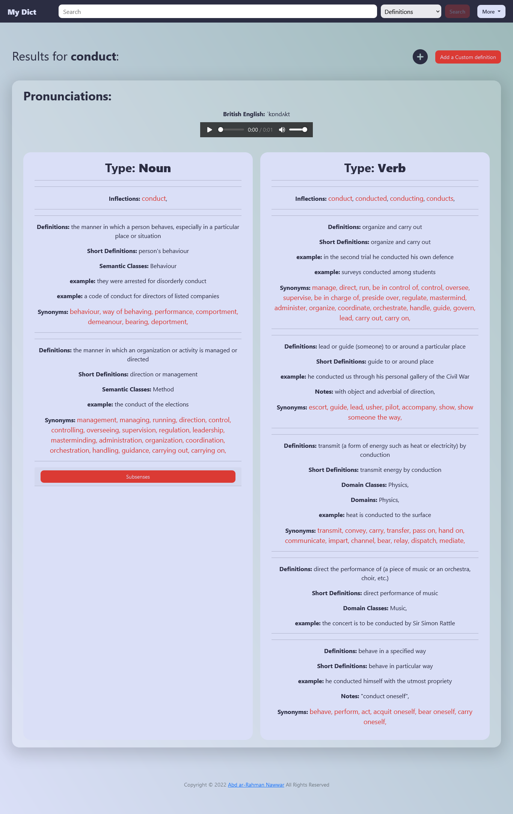

# My Dict

## Table of contents

- [Video Demo](#video-demo)
- [Table of contents](#table-of-contents)
- [Overview](#overview)
  - [The project overview](#project-overview)
  - [Screenshot](#screenshot)
  - [My Dict Features](#my-dict-features)
- [Built with](#built-with)
- [Main files](#main-files)
- [What I learned](#what-i-learned)
- [Useful resources](#useful-resources)
- [Author](#author)

### Video Demo: [youtube](https://youtu.be/-_AE7l3iYn8)

### Overview
#### Project overview
My Dict is a web application that depends on **Oxford Dictionaries API**, Its is an online dictionary by which you can search for definitions for English words and translations for English words to Arabic language.

#### Screenshot

#### My Dict Features
Through My Dict you can:

- Search for definitions for English words.
- Search for translations for English words (English - Arabic).
- Add custom definitions for any word.
- Save words to your word list.
- Access all your custom definitions at once.

### Main files

##### JavaScript:

- script_results.js: contains functionality of adding custom definition.
- script.js: containss Log In and Register Functionality.

##### Python:

- app.py: contains the app business logic.
- helper.py: contains login required functionality.

##### templates folder:
- It contains all the html files for the project.
- layout.html file is the main layout for this project, and **Ninja Templates** were used in this project to take the advantage of the multiple page constant style

### Built with

- HTML
- CSS
- JavaScript
- Flask
- Jinja templating engin
- jQuery

### What I learned

I learned how to use how to make a complete web application, including both Front-End and Back-End.

I learned also how to pass information between the client and the server using jQuery.

### Useful resources

- [Jinja](https://jinja.palletsprojects.com/en/3.1.x/) - This helped me to create HTML pages that have common components. I really liked this pattern and will use it going forward.
- [Python flask and AJAX](https://towardsdatascience.com/using-python-flask-and-ajax-to-pass-information-between-the-client-and-server-90670c64d688) - This is an amazing article which helped me to understand how to pass information between the client and the server. I'd recommend it to anyone still learning this concept.
- [Oxford Dictionaries API](https://developer.oxforddictionaries.com/) - This is the API that I used in this project.

## Author

- Twitter - [@ar_nawwar](https://twitter.com/ar_nawwar)

